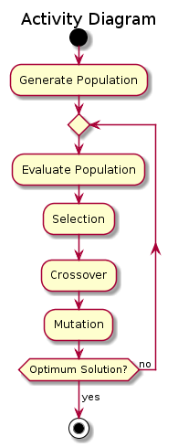
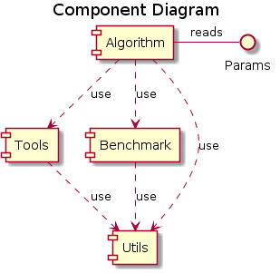
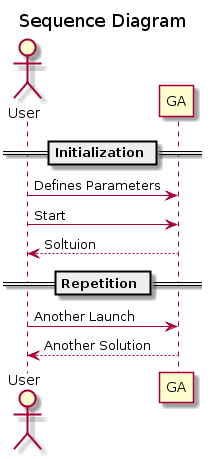

# Genetic Algorithms for Unconstrained Single-Objective Optimization Problems

## 1. UML Diagrams(at least 3 diagrams)

* Activity diagram

* Component diagram

* Sequence diagram

## 2. Metrics (at least two. Sonarcube would be great)

TODO

## 3. Clean Code Development

__Kill Useless Code__. There is no code without a task left in the source files. Any piece of code can be run depending on the algorithm parameters.

__Delete Useless Comments__. The source code of sufficiently documented on the module as well as function level (dockstrings). Some comments throughout the code can fascilitate understanding of the logic. For example, in module `tools.py` in function `_rank_selection` the comments in the beginning of the function explain how the rank selection is to be implemented.

__Invest in a Precise Naming__. Each module, function and variable name has a meaninngful name. E.g., module `tools.py` contains functions such as `create_population` (line 13), `selection` (line 54), `crossover` (line 78), `mutation` (libe 103), and others, which perfom corresponding genetic algorithm operations of the principle of a natural selection. They, in turn, have local variables such as `population` (line 31), `child` (line 101), `chromosomes` (line 118), and many others, which speak for themselves.

__Avoid Magic Numbers__. This realization of the genetic algorithm utilizes two parents for reproduction (module `tools.py`). To avoid a magic number '2' in loops in functions `_proportional_selection` (line 131), `_rank_selection` (line 157) and `_tournament_selection` (line 189), a constant `PARENTS` (line 11) is defined instead.

__No Sideeffects. Ensure that "Changes have Local Consequences"__. Refer to point 9 below.

__Know and apply refactoring patterns__. Visual Studio Code supports various refactoring [operations](https://code.visualstudio.com/docs/editor/refactoring).

__Encapsulate Conditionals__. Python allows compact readable condiotions such as in funtion `_within_range` (line 212) on line 225 in module `benchmark.py`.

__Don’t Repeat Yourself__. Example of automation of repetitive tasks and avoiding duplicated functionality can be the use of the function `roulette_wheel` (line 68, module `utils.py`) in functions `_proportional_selection` and `_rank_selection` (lines 131 and 157 in  module `tools.py`).

__Favour Composition over Inheritance__. The project's implementation is classless and, consequently, has no inheritance.

__Use assertions__. The use of assertions can be found in function `get_scores` (line 9, module `benchmark.py`). The function inside `get_scores` may return `None`, if one of the condions inside them fails, which will lead to the assertion error.

__Source Code Conventions__. The project follows the python source code conventions [PEP 8 Style Guide](https://www.python.org/dev/peps/pep-0008/).

__Automated Unit Tests__. Several untit test have been implemented (file `tests_all_py` in project's `tests` directory).

__Use Mocks__. The implemented unit tests use mock-up objects. For example, function `setUp` (line 16, module `tests`) creates several mock-up objects to later test such function as `_decode`.

__Functional Techniques__. The project tries to follow the functional teqniques. For more information, see point 7 below.

## 4. Build Management with any Build System as Ant, Maven, Gradle, etc. (only travis is not enough) Do e.g. generate Docs, call tests, etc.

TODO

## 5. Integrate some nice Unit-Tests in your Code to be integrated in the Build

TODO

## 6. Continous Delivery (show me your pipeline in e.g. Jenkins, Travis-CI, Circle-CI, etc.)

TODO

## 7. Integrated Development Environment

Task: _Use a good IDE and get fluent with it as e.g. IntelliJ. What are your favourite Key-Shortcuts?_

The project was developed in Micrisift Visual Code. It comes with a built-in IntelliSense facilitating code development. On top of that, additional plugins for Python were installed, enabling debugging and linting.

Often used shortcuts:

Combination | Description
--- | ---
`Ctrl+K Ctrl+O` | Open Folder (project)
`Ctrl+K F` | Close Folder (project)
`Ctrl+B` | Toggle Sidebar
`Ctrl+J` | Toggle Panel
`Ctrl+/` | Toggle Line Comment
`Ctrl+Z` | Toggle Word Wrap
`F11` | Toggle Full Screen
`F1` or `Ctrl+Shift+P`| Command Palette
`Ctrl+P` | Go to File..., Quick Open
`Ctrl+\` | Split Editor
`Ctrl+[n]` | Focus into _n_-th Editor Group
`Ctrl+F` | Find
`Ctrl+H` | Replace
`Alt+Down` | Move Line Down
`Alt+Up` | Move Line Up
`F9` | Toggle Breakpoint
`F5` | Start/Continue Debugging
`F11` | Step Into
`Shift+F11` | Step Out
`F10` | Step Over
`Shift+F5` | Stop

## 8. Domain-Specific Language

__YAML as DSL__. The project utilizes genetic algorithm hyper-parameters being specified in YAML file as `parameters.yaml`. The file is located in the project's root directory. It is parsed by an external library [PyYAML](https://pyyaml.org/). The contents of the file are read in the module `algorithm.py` (line 189) and are further passed to the main function of the algorithm (line 192).

## 9. Functional Programming

Task: _Prove that you have covered all functional definitions in your code as:_

   - only final data structures
   - (mostly) side effect free functions
   - the use of higher order functions
   - functions as parameters and return values
   - use clojures / anonymous functions

Final data structures

Side effect free functions. Examples of these functions can be found throughout the modules. In module __`tools.py`__: functon `elitism` (line 35); functions `_proportional_selection` (line 131), `_rank_selection` (line 157), `_tournament_selection` (line 189), `_one_point_crossover` (line 216), `_two_point_crossover` (line 241) and `_uniform_crossover` (line 274) are not pure due to the random number generator component, but rather non-deterministic side effect functions. In module __`benchmark.py`__, the example of side effect free functions are `_decode` (line 73), `_function_1` (line 131), `_function_2` (line 145), `_function_3` (line 159), `_function_4` (line 175), `_convert_to_fitness` (line 191), `_within_range` (line 212). In the module __`utils.py`__: functions `dim_number` (line 28) and `chromosome_length` (line 48); the function `roulette_wheel` (line 68) is again not pure due to the random component, but a non-deterministic side effect free function.

The use of higher order function can be found in the module `tools.py` functions `create_population` line 13, `_proportional_selection` line 131, `_rank_selection` line157, and `_two_point_crossover` line 241. As well as in the module `benchmark.py` functions `_function_3` line 159, `_function_4` line 175.

A closure can be found in the module `benchmark.py` line 73, definition of the function `_decode`, which in tern returns the internal function. The closure is being called in the same module in the function `get_scores` line 23.

Anonymous functions can be found in the module `utils.py` line 8 (function `swap`) and line 10 (function `square`).
